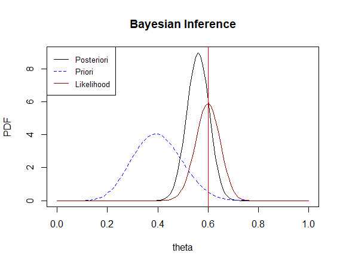

# Introduction to Bayesian Inference

Examples of determination of posterior distributions with different priori and likelihood distributions.
Examples of applications of Markov chain Monte Carlo methods (e.g. Gibbs sampling).

Gibbs Sampling Estimations to multilinear regression

